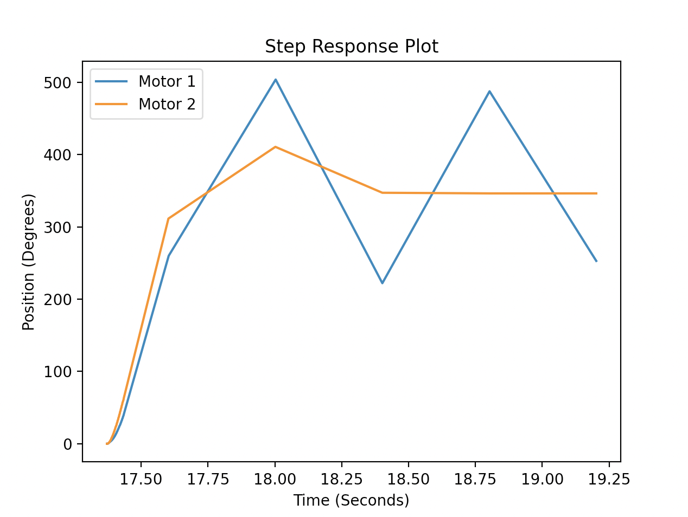
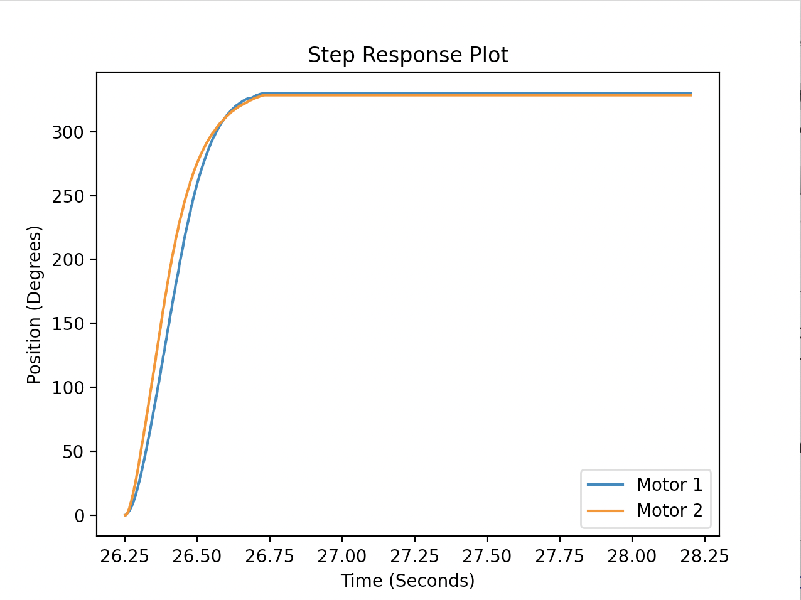

# Lab3
## ME 405 Lab 3 Repository

In this experienment we used cotasks to control the execution of our Finite State Machine
and subsequently the step response of our motors. This method of task scheduling is more
robust and efficient than the method used in Lab2, in which we simply ran our tasks in
order with no specific frequency or period. 

Our closed loop controller utilizes position feedback to command our test kit motors
to follow a step response and rotate a flywheel 1 rotation. Our controller utilizes proportional control of the form
*KP*(*&theta;ref* - *&theta;meas*). The figures below 
display our progression of tuning our task period to optimize the computational intensity
of our controller.

We found that too large of a motor period led to poor controller performance, as seen in
Figure 1. The period at which the controller's performance became unacceptable was 400
ms. The recommended speed at which the motor task should be run is 100 ms. Figure 2 displays
a plot of the step response with the recommended frequency. After decreasing the task period
to less than 100 ms, we observed diminishing step response returns.

 
Figure 1. Step response with controller frequency of 400 ms; *KP* = 0.01. 

 
Figure 2. Step response with controller frequency of 100 ms; *KP* = 0.01.

We found that depending on the motor task frequency, sometimes our microcontroller would not correctly interpret user input commands
from our PC. Resetting the microcontroller and rerunning the CPython program once or twice usually fixes this issue and allows us to
properly execute a step response.